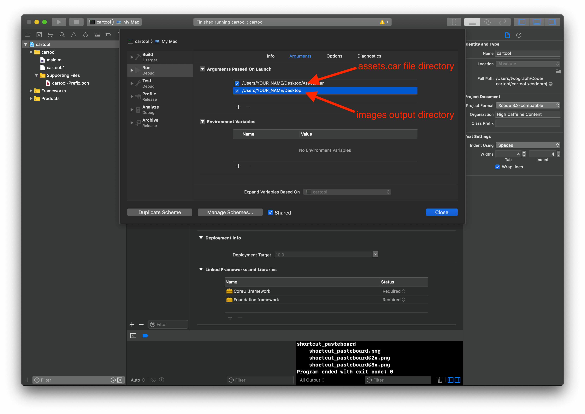

cartool
=======

Export images from OS X / iOS .car CoreUI archives. Very rough code, probably tons wrong with it, but still useful.

## Usage (macOS 10.14 Majave supported)

- Edit Scheme and add **assets.car directory** and **images output directory**.
- Run this project and then you can get what you want.

